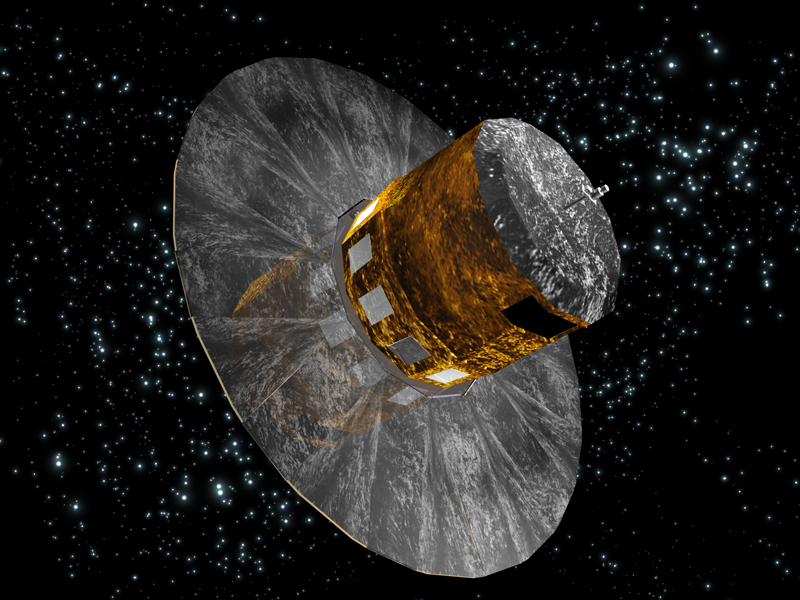
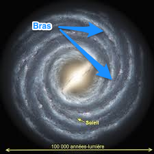
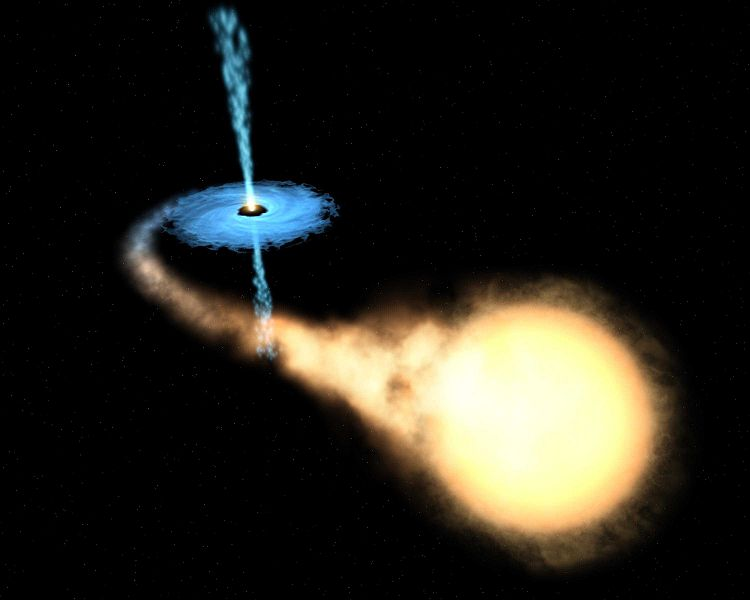
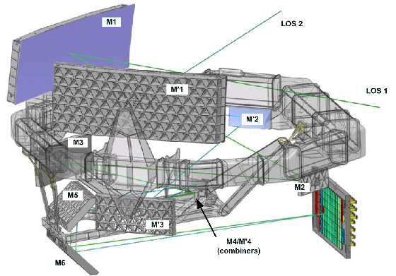
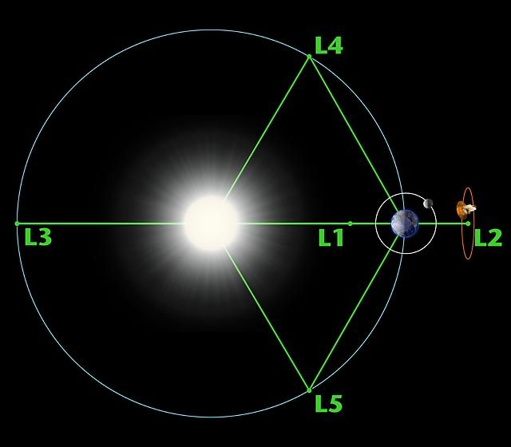
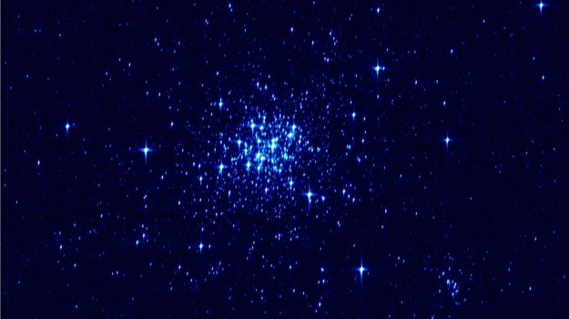

Notre Voie lactée est composée de milliards d'étoiles, dont il est difficile d'appréhender l'étendue.
Afin d'augmenter la compréhension de notre univers proche et lointain, de son histoire et de ses lois, l'Agence spatiale européenne a développé la mission Gaia, en référence au grec ancien  Γαῖα, qui signifie «déesse mère».

Par le biais d'un satellite innovant lancé le 19 décembre 2013, il est désormais possible de scanner le ciel avec une précision mille fois supérieure à celle des observations depuis le sol, et l'apport de cette technique promet des découvertes intéressantes.

GAIA est le successeur du satellite Hipparcos, et permet de localiser 100 000 fois plus d’objets avec une précision 100 fois plus grande que ce dernier.

Le coût de la mission est évalué à 740 millions d'euros, auquel il faut ajouter celui du consortium en charge du traitement des données, estimé à environ 200 millions d'euros.

> Figure 1. Le satellite GAIA

## OBSERVATIONS ET TRAITEMENT DES DONNEES:

Le principal défi de la mission Gaia est le traitement des données que l'Agence spatiale européenne reçoit.

En effet, le satellite envoie des informations pendant 8 heures chaque jour, ce qui représente 100 Giga-octets de données quotidiennes à traiter.  A cela vient s'ajouter le traitement cyclique : le satellite observe la totalité du ciel par cycle de 6 mois et les informations sont retraitées à la fin de chaque cycle.
Afin de gérer cette masse de travail, une centaine de scientifiques travaille dans 6 centres de traitements des données à travers la France ; ils réalisent 6000 milliards d'opérations par seconde.

L'observation se concentre sur l'archéologie galactique, l'étude des astéroïdes du système solaire (leur orbite, masse, couleur, réflexion avec le soleil) et les interactions entre galaxies.

Les données envoyées par le satellite Gaia permettent de:

- observer très précisément la structure et la vitesse des étoiles qui se trouvent dans les parties centrales de la Voie Lactée, et recenser toutes les étoiles rencontrées (position et vitesse de déplacement) ;
- observer la forme des bras spiraux très proches du soleil,
- mesurer la taille du disque de la Voie Lactée,
- distinguer la présence d'exoplanètes et d'en donner la masse,
- connaitre la distance de l'orbite de l'exoplanète à l'étoile,
- comprendre la formation et les étapes d'évolution de la galaxie.

> Figure 2. La voie lactée

## OBJECTIFS ET ESPERANCES:

### Cartographie de la galaxie

L'objectif de la mission Gaia est d'établir en 5 ans une cartographie en 3 dimensions de la portion de la Voie Lactée qui entoure le Système Solaire, grâce à des mesures d'une précision inégalée à ce jour. La forme et la morphologie de la Voie Lactée devraient être reconstruites.
Pour cela, il est prévu qu'environ un milliard de sources – soit à peine 1% des sources de notre galaxie – et de nombreux objets extra galactiques plus lointains (nommés quadras) soient observés entre 2014 et 2019.

Par ailleurs, 30 000 petites planètes devraient être découvertes au cours de cette mission.

Cette cartographie de la galaxie permettra de consolider ou réfuter les modèles de formation et de dynamique des galaxies déjà établis, puis de résoudre de grandes énigmes. Les informations les plus attendues par les astronomes concernent la formation initiale et les mécanismes de formation de disques d'accrétion des galaxies, ainsi que la structure en spirale et le nombre de bras de la Voie lactée.

> Figure 3. La forme de la structure est engendrée par l'action de la force gravitationnelle, attirant le matériel vers le corps central, les différentes vitesses initiales des particules, qui entraînent le matériel en forme de disque, et la dissipation d'énergie en son sein par viscosité, entraînant le matériel en spirale vers l'organe central.

### Physique stellaire

Grâce à ses observations spectroscopiques, Gaia doit aussi contribuer à mieux comprendre le fonctionnement interne des étoiles. Les recherches sur la vie des étoiles et la dynamique de leur formation au sein des galaxies pourraient avancer considérablement grâce aux données fournies par le satellite.

### Matière noire

En outre, Gaia est utilisé pour mieux mesurer l’influence et la trace de la matière noire.
Ses mesures identifieront précisément les traces de perturbation gravitationnelle provoquées par la matière noire, permettant ainsi d'affiner la connaissance de la distribution de la matière.
En effet, si la matière noire existe, elle agit sur l'évolution de la galaxie et une cartographie du mouvement précis des étoiles permettrait de savoir comment la matière noire se répartit.

### Système de référence

Le grand nombre de mesures très précises sur plusieurs catégories d'objets permettront d'affiner les systèmes de référence utilisés dans tous les domaines de l'astronomie.
Parmi ces objets, on retrouve les objets Quasars, dont le nom vient de "quasi-stellar astronomical radiosource". Le quasar est une source intense présentant un grand décalage vers le rouge du spectre électromagnétique qui apparaît comme une étoile ou comme un centre de galaxie active très compact. Il libère une énergie équivalente à des centaines voire 1 millier de galaxies combinées. Contrairement aux sursauts gamma ou supernovae, l'énergie est émise sur une longue durée bien que certains montrent des variations en brillance sur quelques mois à quelques heures. Certains quasars émettent des jets de matières et possèdent des lobes comme les radiogalaxies.

### Planètes extrasolaires

Bien que ce ne soit pas dans sa mission principale, Gaia pourrait découvrir entre 10 et 20000 planètes extrasolaires grâce à la précision de ses mesures photométriques et astrométriques (chaque objet devrait être vu environ 100 fois durant la mission).

### Courbure de la lumière par le Soleil

La mesure de la courbure des rayons lumineux provenant des étoiles de l'ensemble du ciel due aux effets gravitationnels sera effectuée avec une précision inégalée, permettant d'affiner les paramètres γ et β de la théorie de la Relativité Générale.

## COMPOSITION TECHNIQUE :

* Tout d'abord, le satellite Gaia se compose de 2 télescopes en carbure de silicium qui reflètent leur lumière sur un plan focal de 100 milliards de pixels.

* Le carbure de silicium est une céramique révolutionnaire (cuite à 2.100°C) aussi rigide que les métaux, mais deux ou trois fois plus légère. Homogène, elle se dilate très peu sous l'effet de la chaleur. Télescopes spatiaux plus légers et résistants aux grandes variations de température dans l'espace (fait par l'entreprise qui a fabriqué le plus grand miroir spatial conçu à ce jour (3,50mètres de diamètre) ).

* En carbure de silicium: dix miroirs rectangulaires, mais aussi l'anneau de 3,50 mètres de diamètre qui les porte et le radiateur des cellules. «Fabriquer la structure et le miroir dans le même matériau rend l'ensemble plus léger et plus simple à assembler qu'un mélange de céramique et de métaux».

* Puis, il est constitué de 3 instruments de mesure:
- un astromètre, qui mesure la position, le mouvement et la distance des étoiles,
- un photomètre, qui mesure la luminosité et la couleur des étoiles,
- un spectromètre, qui mesure la vitesse et la composition gazeuse des étoiles, et qui est étalonné grâce aux mesures au sol.

* Enfin, il contient la caméra numérique la plus grande et  la plus précise jamais construite pour une mission spatiale. Combinés, ses 106 capteurs CCD représentent une « matrice d'un milliard de pixels" qui sert d'œil super-sensible à la mission de l'ESA. Son angle d'observation va jusqu’à 10 microsecondes d’arc (une seconde d’arc équivaut à 1/3600e de degré). De quoi détecter un cheveu à 1.000 kilomètres de distance (Paris-Rome) ou l'ongle d'un pouce depuis la Lune!

* Pour l’aider dans ses observations, Gaia dispose comme point de référence du plus grand télescope de l’observatoire du Pic du Midi dans les Pyrénées.

> Figure 4. Dessin technique de GAIA

* Son positionnement, sa rotation continue sur lui-même (spin) et sa rotation autour du soleil au cours de l'année assurent au satellite Gaia une observation uniforme du ciel et donc un échantillonnage régulier – comme précisé plus haut, un objet sera observé environ 100 fois sur la durée de vie de la sonde.

* Masse totale de 2 tonnes.

## MISSION:

Gaia observera 1,3 milliard objets d'une magnitude inférieure à 20 dont 350 millions sont de magnitude inférieure à 18 parmi lesquelles 35 millions sont de magnitude inférieure à 15.
Leur vitesse radiale sera mesurée avec une précision de 2 à 10 km/s pour les objets de magnitude <17 Gaia est équipé d'un système de détection interne et autonome : à la différence d'Hipparcos dont les observations étaient ciblées à partir d'un catalogue d'objets connus, Gaia observera tous les objets dans son champ de vue, permettant ainsi d'en découvrir de nouveaux.
- Lancement à la date t0 (second semestre 2013)
- Transfert à poste au point de Lagrange \\(L_2\\) : t0 + 3 mois
- Recette en vol et étalonnage jusqu'à T0 + 6 mois.
- Observations en continu pendant 5 ans avec en moyenne chaque seconde :
                80 observations astrométriques (x 9 CCDs)
                80 observations photométriques
                50 observations spectroscopiques (x 3 CCDs)
- Transmission des données ~ 11h par jour à Cebreros, avec un débit de 4 à 8 Mbps

### Accession à son orbite opérationnelle :

Gaia, le cartographe d'un milliard d'étoiles de l'ESA est maintenant sur son orbite opérationnelle autour du point de Lagrange "\\(L_2\\)", un point virtuel gravitationnellement stable à 1,5 millions de kilomètres de la Terre. Gaia est sur son orbite de 180 jours autour de \\(L_2\\), une orbite de 263 000 x 707 000 x 370 000 kilomètres.
L'insertion en orbite autour de \\(L_2\\) est une tâche relativement complexe, accomplie en effectuant la poussée des moteurs de Gaia de manière à pousser le véhicule spatial dans la direction voulue, tout en protégeant les délicats instruments scientifiques du Soleil.
Une fois que les instruments du véhicule spatial auront été entièrement testés et calibrés - une activité commencée pendant le trajet vers \\(L_2\\) et prévue pour durer encore quatre mois - Gaia sera prêt à entrer dans sa phase opérationnelle de cinq ans.

### Points de Lagrange

Le satellite Gaia se positionne au point de Lagrange \\(L_2\\), à environ 1.5 million de kilomètres de la Terre.

Un point de Lagrange est une position de l'espace dans un système à deux corps, où les champs de gravité des corps se combinent de manière à fournir un point d'équilibre à un troisième corps de masse négligeable, tel que les positions relatives des trois corps soient fixes.

Au point \\(L_2\\), les champs de gravité de la Terre et du Soleil se compensent, les corps qui s'y trouvent suivent alors une orbite autour du Soleil a la même vitesse angulaire que la Terre. Cela permet au satellite de conserver une position fixe relativement aux deux autres corps, et donc de rester synchronisé à la Terre tout en captant des données de la Galaxie et du Soleil. Par ailleurs, l'environnement thermique y est stable puisque peu d'éclipses s'y produisent.

<iframe width="560" height="315" src="//www.youtube.com/embed/z52WWLE8bBo" frameborder="0" allowfullscreen></iframe>

> Figure 5. Animation sur les points de Lagrange

#### Application du point de Lagrange entre le Soleil et la Terre

Les points \\(L_1\\) et \\(L_2\\) sont situés à proximité de la Terre, le point \\(L_3\\) est symétrique de la Terre par rapport au Soleil, et les points \\(L_4\\) et \\(L_5\\) sont aux sommets de triangles équilatéraux ayant le segment Soleil-Terre pour base.
Malgré ce que pourrait laisser penser la figure, les orbites autour de \\(L_4\\) et \\(L_5\\) sont stables, et les trois autres instables, à cause de la force de Coriolis, ce qui implique que ces derniers sont contraints à observer une trajectoire circulaire autour du point de Lagrange.

> Figure 6. Les points de Lagrange

#### Calcul de la distance des points de Lagrange à la Terre

Ce phénomène résulte des lois de la gravité, des lois de la mécanique (de Newton) ainsi que de la force centrifuge. Nous rappellerons donc les lois (relatives à ces différents phénomènes physiques) qui seront utiles pour le calcul de la distance des points de Lagrange à la Terre.

##### Gravité

Deux corps situés à une distance d l'un de l'autre sont attirés par une Force F qui est proportionnelle à leur masse et inversement proportionnelle au carré de leur distance.

C'est une force UNIVERSELLE, qui ne peut pas être annulée ni masquée et qui agit à distance.

$$F=G.\frac{M.M'}{d^2}$$

Avec \\(G = 6,67.10^{-11} Nm^2/kg^2\\) la constante de gravitation universelle, ainsi que \\(M\\) et \\(M’\\) les masses respectives des corps 1 et 2 et \\(d\\) la distance entre ces deux corps.

##### Mécanique: Les lois de Newton

**Première Loi :** En l'absence de forces agissant sur lui, tout corps est soit au repos soit se déplace à vitesse constante en ligne droite.

**Deuxième Loi :** Quand une force est appliquée à un corps, il s'accélère dans la même direction et cette accélération est proportionnelle à la Force et inversement proportionnelle à sa masse.

Rappel : sur Terre \\(\Gamma\\) est égale à \\(g=  9,8 m/s/s\\) (accélération de la pesanteur)

**Troisième Loi :** Toute action entraîne une réaction égale et opposée.

##### Force centrifuge

$$F_c=m*a$$
$$a=\frac{v^2}{r}$$
$$v=\frac{2\pi r}{T}=TODO$$
$$T=\sqrt{\frac{r^3}{GM}}$$

##### Exemple: calcul de la distance entre la Terre et le point \\(L_1\\)
Les forces qui agiraient sur un satellite positionné au point \\(L_1\\) sont:

- \\(F_s\\) Attraction du soleil
- \\(F_t\\) Attraction de la Terre
- \\(F_c\\) Force centrifuge autour du soleil
- \\(F\_s = F\_c + F_t\\)

On a les données suivantes:

- \\(M\\) masse du soleil
- \\(m\\) masse de la Terre
- \\(\mu\\) masse du satellite (très petite face à \\(m\\) et \\(M\\))
- \\(R\\) Distance Soleil-Terre
- \\(r\\) distance de \\(L_1\\) à la Terre

D’après les équations ci-dessus:

$$F_s = \frac{GM\mu}{(R-r)^2}$$

$$F_t = \frac{Gm\mu}{r^2}$$

$$F_c = \frac{\mu V^2}{(R-r)}$$

et

$$VT = 2\pi(R-r)$$

Nous avons donc en simplifiant : 

$$\frac{GM}{(R-r)^3} - \frac{Gm}{R^2(R-r)} = \frac{4\pi ^2}{T^2}$$
   
Or, en ce point la période de rotation autour du soleil T est ÉGALE  à celle de la Terre (1 an) puisque le point est fixe par rapport à celle-ci. Mais si on considère la Terre seule, elle est en équilibre entre l'attraction solaire et la force centrifuge de la terre sur son orbite, on peut donc écrire, si T est aussi la période de rotation de la terre (1 an) :

$$\frac{GMm}{R^2} = \frac{mV_r^2}{R} = \frac{m4\pi^2R^2}{RT^2}$$

En remplaçant dans la formule plus haut :

$$\frac{GM}{(R-r)^3}-\frac{Gm}{R^2(R-r)}=\frac{GM}{R^3}$$

Pour simplifier, on pose : \\(y = \frac{m}{M}\\) (très petit) et \\(z = \frac{r}{R}\\) (petit)

En sachant que \\(\frac{1}{(1-z)^3} \approx 1 + 3z\\), l'équation se simplifie en :

$$3 z^3 = y$$

Soit :

$$3 (\frac{r}{R})^3 = \frac{m}{M}$$

##### Dans le cas du système Terre-Soleil

Le soleil est 330.000 fois plus lourd que la Terre (\\(\frac{m}{M} = 3.10^{-6}\\)), on en déduit que le rapport \\(\frac{r}{R}\\) vaut approximativement 1%. Donc la distance entre le point de Lagrange \\(L_1\\) et la terre est égale à 1% de la distance Terre-Soleil soit  \\(r = 1,5 MKm\\) de la Terre.  

On pourrait aussi calculer la distance de \\(L\_2\\) (où \\(F\_s = F\_t + F\_c\\)) qui est symétrique par rapport à \\(m\\) (la Terre) donc aussi à \\(1,5 Mkm\\) de celle-ci.

### Un exemple d'observation: l'amas stellaire NGC 1818

L'amas stellaire NGC 1818 est une galaxie distante de 160 000 années lumière.
L'image a été prise dans la phase de réglage et de vérification qui a suivi le lancement du satellite.
Elle reflète l'intensité lumineuse de chaque étoile de l'amas (mais pas les vraies couleurs).

Une des premières images envoyées par Gaïa:

> Figure 7. Exemple d'observation avec GAIA

## CONCLUSION

Les résultats de la mission ne devraient pas être publiés avant 3 ans après la fin de la mission, c'est-à-dire qu'ils seront publiés aux alentours de 2020.
Ces résultats sont pleins de promesses et seront attendus avec impatience par la communauté scientifique, pour pouvoir avancer encore un peu plus dans la connaissance de l'univers qui nous entoure!
