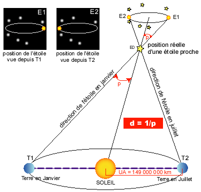
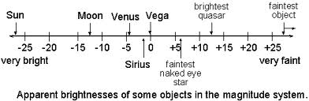

Le satellite Hipparcos (HIgh Precision PARallax COllecting Satellite) était une mission spatiale de l'Agence spatiale européenne destinée à observer et cataloguer les étoiles. C’était la première mission ayant pour but de mesurer la position, les mouvements, la brillance et la couleur des étoiles.
Le nom du satellite à été donné en hommage à un astronome grec Hipparque qui réalisa un des premiers catalogues d’étoiles.
Le projet est proposé en 1980. Le satellite est lancé le 8 août 1989 par un lanceur Ariane IV. Le satellite devait initialement être placé sur une orbite géostationnaire mais suite à une panne du moteur d’apogée, Hipparcos est resté sur l’orbite de transfert. Malgré ce problème, les objectifs scientifiques ont pu être totalement remplis. Les communications avec le satellite se sont interrompues le 17 août 1993, soit 4 ans d’observation du ciel.
Le satellite a été utilisé pour mesurer la distance de plus de 2,5 millions d'étoiles situées à moins de 500 années-lumières de la Terre.
Trois catalogues d'étoiles ont été produits grâce à Hipparcos : les catalogues Hipparcos, Tycho et Tycho 2. Ces catalogues ont permis de nombreux progrès dans notre connaissance des étoiles et de leur évolution, ainsi que dans l’étude des structures de galaxies et de leur dynamique. Il a engendré des progrès considérables dans les domaines tels que la détermination de l’âge de l’univers, le taux de formation des étoiles, les stratégies de recherches d’exoplanètes, la détermination des âges glaciaires, etc.

## Objectifs

Les objectifs du satellite étaient scindés en 2 parties:

1. L’expérience Hipparcos: mesurer les paramètres astrométriques (position,<a data-toggle="tooltip" title="mouvement propre= déplacement apparent sur le plan tangent du ciel par rapport au système solaire, ce mouvement est mesuré en relevant à intervalle réguliers la position de l’étoile dans le ciel. Parallaxe : Regardée alternativement avec chaque œil, la projection du pouce, main tendue, ne se trouve pas devant les mêmes éléments d’un décor. Cet effet de perspective s’appelle la parallaxe. La parallaxe est d’autant plus petite que l’objet visé est loin. De même, à mesure que la Terre se déplace sur son orbite autour du Soleil, les étoiles proches changent légèrement de position par rapport aux étoiles les plus distantes, à l’arrière-plan. Ce changement d’angle permet de calculer par trigonométrie l’éloignement des étoiles proches. L’ellipse de parallaxe n’est autre que la projection du mouvement de la Terre, elle prend la forme d’un cercle aux pôles de l’écliptique(= projection de l’orbite terrestre sur la voute céleste, correspond également au déplacement apparent du Soleil parmi les étoiles sur une année). Cet angle de parallaxe p (p=1/d) est mesuré à 6 mois d’intervalle. -&gt; permet ensuite de déterminer la distance Terre-étoile.">mouvement propre et parallaxe</a>, vitesse radiale) d’environ 120 000 étoiles proches de la Terre avec une très haute précision.

2. L’expérience Tycho: mesurer les propriétés astrométriques et photométriques de 400 000 autres étoiles situées dans la même région avec une moins bonne précision. La vitesse radiale est ensuite déterminée en s’appuyant sur l’effet Doppler-Fizeau qui modifie le spectre lumineux de l’étoile en fonction de cette vitesse.

> Figure 1. Schéma explicatif de la méthode de mesure de la parallaxe

## Caractéristiques techniques

- Dimensions: Hauteur de 3 m, diamètre de 1,8 m, poids de 1140kg.
- Le contrôle de l'orientation de la plateforme (en aluminium) est réalisé à l’aide de 4 moteurs-fusées. Le satellite est en rotation lente à la vitesse de 11,25 tours par jour. L’énergie électrique est fournie par 3 panneaux solaires qui fournissent 380 W. Deux batteries nickel-cadmium fournissent l’énergie lorsque la sonde est plongée dans l’obscurité. L’émetteur de 2,5 Watts permet de transmettre les données scientifiques vers la Terre (24 kilobits/s).
- La charge utile: constituée d’un <a data-toggle="tooltip" title="télescope astronomique construit de sorte à garantir un important champ de vue tout en limitant les aberrations optiques.">télescope de Schmidt</a> (télescope astronomique construit de sorte à garantir un important champ de vue tout en limitant les aberrations optiques.) de diamètre 29cm et doté d’une focale de 1,4 mètre. Cet appareil permet ainsi l’observation d’étoiles d’une <a data-toggle="tooltip" title="échelle permettant de répertorier les étoiles en fonction de leur luminosité (le niveau zéro ayant été obtenu arbitrairement à partir de certaines étoiles étalons). Plus l’éclat d’un astre est faible, et plus la valeur de sa magnitude augmente. Pour une différence de 1 magnitude, leur luminosité diffère d’un facteur égal à 2,5-&gt; une étoile de magnitude 6 est de luminosité 100 fois plus faible qu’une étoile de magnitude 1. On calcule m tel que : m= -2,5log E +k (où E est l’éclat stellaire et k une constante). Cette échelle à permis d’attribuer des magnitudes négatives à certaines étoiles(le niveau zéro ayant été obtenu arbitrairement à partir de certaines étoiles étalons). Elle est également applicable aux planètes, astéroïdes, comètes, etc.">magnitude apparente</a> allant jusqu’à 12,4, c'est-à-dire d'une luminosité 400 fois inférieure à ce qui peut être perçu à l’œil nu depuis la Terre.

> Figure 2. Luminosité apparente de certains objets

Le téléscope observe simultanément deux zones du ciel d’une surface de 0,9°*0,9° situées à 58° l’une de l’autre. En effet, le télescope utilise l’écartement angulaire entre les étoiles comme référentiel: l'ensemble des mesures unidimensionnelles combinées avec la connaissance de l'orientation du télescope au moment de l'observation permettent de reconstituer la position des étoiles. Les deux images sont superposées sur un plan focal comportant un détecteur de 2,5 cm × 2,5 cm.
Du fait de la rotation lente du satellite autour de son axe (un tour toutes les 128 minutes) l'image des étoiles traverse lentement le détecteur constitué d'une grille composée de 2 688 bandes alternativement transparentes et opaques. Derrière cette grille, un détecteur de type photomultiplicateur analyse les variations de lumière toutes les 2 secondes. Ce système permet de mesurer la position de 118 000 étoiles avec une précision de 0,002 arcs-seconde. Un deuxième photomultiplicateur exploite un faisceau lumineux dérivé du faisceau principal pour déterminer et contrôler l'orientation du satellite et effectuer des mesures sur 1 million d'étoiles avec une précision plus faible de 0,03 arcs-secondes. L'axe de rotation du télescope est modifié tous les jours de 4,415° ce qui permet sur la durée de la mission d'observer à plusieurs reprises l'ensemble du ciel : en moyenne une étoile traverse le détecteur en 20 secondes et est observée à 110 reprises sur environ 30 époques différentes réparties au cours des 3 ans de la mission.

## Déroulement de la mission

Hipparcos est lancé le 8 août 1989 par une fusée Ariane 44LP depuis la base de lancement de Kourou. Le lanceur place le satellite sur une orbite de transfert elliptique de 200x35896 km avec une inclinaison de 6,9°. Une fois parvenu à son apogée, le moteur d'apogée Mage doit être déclenché pour circulariser l'orbite et placer Hipparcos sur une orbite géostationnaire au niveau de la longitude 12° Ouest. Mais la mise à feu du propulseur à propergol solide ne se déclenche pas et le satellite reste coincé sur son orbite de transfert qu'il parcourt en environ 10 heures. L'équipe projet met au point en quelques semaines de nouvelles modalités d'utilisation du satellite permettant le recueil des données scientifiques dans ce nouveau contexte. Le périgée est rehaussé de 200 à 526 km pour réduire la trainée atmosphérique qui aurait rapidement déformé l'orbite.
Les répercussions sont importantes sur le fonctionnement du satellite: en effet, celui-ci traverse à chaque orbite les ceinture de Van Allen qui lui font subir un bombardement de particules énergétiques nocif pour son électronique et ses panneaux solaires. Ceux-ci se dégradent alors plus rapidement que prévu ! De plus, les batteries doivent faire face à des périodes d’éclipse d’une durée plus longue que celles pour lesquelles elles étaient prévues. Enfin, la base d’Odenwald (Allemagne) ne parvient pas à récupérer toutes les données envoyées par Hipparcos du fait de son vol non stationnaire.
Malgré ces handicaps, Hipparcos parvient à fournir des données scientifiques valides pendant 4 ans (1989-1993), donc plus de 30 mois que ce qui était prévu à la base.
 Le 15 août 1993, confrontés à des avaries du système de guidage et de l'ordinateur de bord de plus en plus fréquentes, les responsables de la mission décident de désactiver le satellite.

## Les Catalogues Hipparcos et Tycho (1 et 2) :

À l'issue de la mission, les données recueillies -représentant plus de 120 millions de mesures et 1000 gigabits de volumes- sont exploitées. 
Les calculs effectués pour déterminer la position des étoiles nécessitent notamment de résoudre 4 millions d’équations à 600 000 inconnues. Les catalogues Hipparcos (118 000 étoiles avec une précision d’une milliseconde d’arc) et le catalogue Tycho (plus d’un million d’étoiles avec une précision de 20-30 millisecondes d’arc) sont achevés en août 1996 et publiés par l’ESA en juin 1997. Les différentes données de ces catalogues ont permis la création du Millenium Star Atlas (atlas couvrant l’ensemble du ciel et comportant un million d’étoiles (\\(mag \leq 11\\)) + 10 000 objets non stellaires). En 2000, une nouvelle version du catalogue Tycho est rédigée : Tycho 2, grâce à une méthode de réduction de données plus avancées, les données y sont plus précises et cette version est beaucoup plus complète (2 539 913 étoiles y sont présentes).

## Bilan

Les mesures effectuées par Hipparcos ont permis de:
-  Prévoir la collision de la comète Shoemaker-Levy 9 avec la planète Jupiter.
-  Identifier les étoiles qui dans le futur passeront à faible distance du Soleil.
-  Mesurer la distance entre la Terre et les étoiles possédant des planètes.
-  Découvrir que la forme de la Voie lactée change au cours du temps.
-  Identifier un groupe d'étoiles qui ont par le passé envahies la galaxie.
-  Remettre en question la taille et l'âge de l'Univers: celui-ci s'est révélé à la fois plus grand et plus jeune.
-  Confirmer la théorie d'Einstein concernant les effets de la gravité sur la lumière des étoiles.

Son successeur: GAIA, projet décidé en 2000, lancé en 2013, a pour but d’établir un catalogue 50 fois plus précis que Hipparcos et d'un milliard d’étoiles. Tandis qu’Hipparcos effectuaient des observations basées à partir d’un catalogue d’objets connus, GAIA est lui équipé d’un système de détection interne et autonome. GAIA observe et observera tout les objets présents dans son champ de vision.
