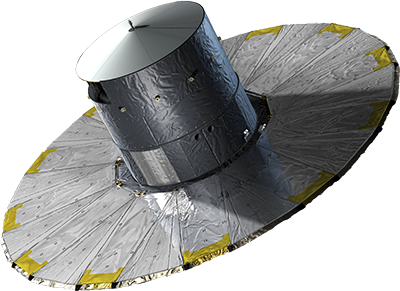

# Les satellites

## Introduction

De très nombreuses questions se posent sur l’univers: comment s’est-il formé, quel âge a-t-il, quelle est sa taille, de quoi se compose-t-il ? Pour répondre à ces questions, des observations depuis la Terre ont été effectuées. Mais cela ne suffit pas pour tout comprendre, c’est pourquoi des satellites ont été conçues spécialement pour sonder l’univers. Au cours des années, ces satellites sont devenus de plus en plus performants, et notamment le dernier satellite lancé pour observer le ciel, Gaïa, est aujourd’hui en pleine mission. Les données recueillis par ces satellites permettent une meilleure connaissance de notre galaxie. Gaïa va également permettre des découvertes sur le reste de l’univers, et sur les plus grands mystères qui y règnent.

## Table des matières

1. [Introduction](#Introduction)
2. [Histoire & économie](histoire.html)
3. [Hipparcos](hipparcos.html)
4. [WMAP](wmap.html)
5. [Planck](planck.html)
3. [GAIA](gaia.html)
