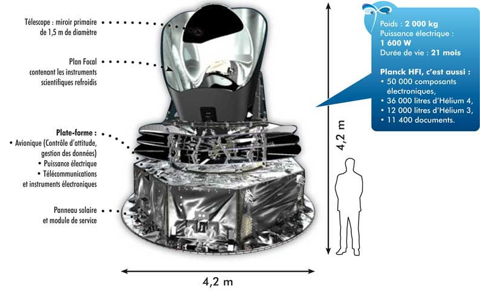
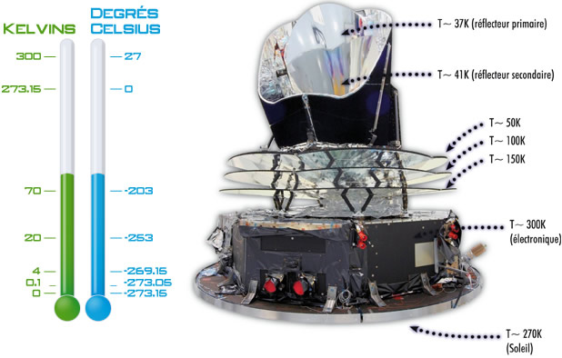
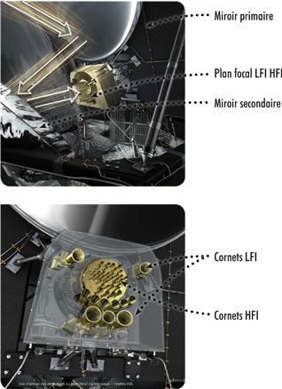
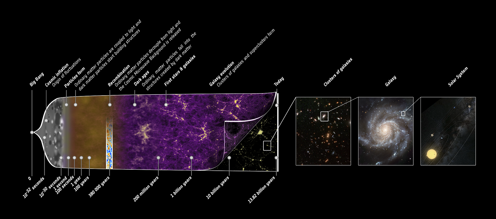
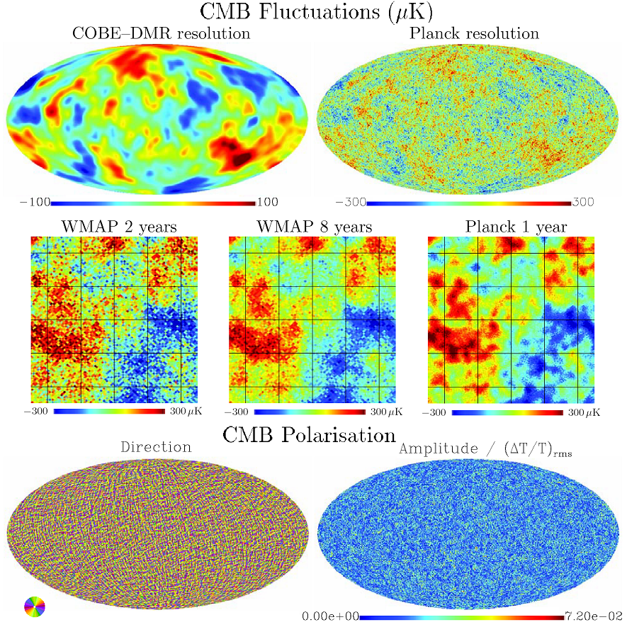

En 1899, Max Planck a expliqué la façon dont un corps à l’équilibre thermique émet un rayonnement. Il a ainsi jeté les bases de la théorie qui décrit le monde microscopique : la mécanique quantique. Le rayonnement fossile cartographié par les instruments du satellite suit parfaitement une loi de corps noir. Il était donc logique d’associer le nom de ce physicien à ce satellite.

À l’origine, le projet majoritairement français s’appelait SAMBA. Il existait un projet italo-américain semblable appelé COBRAS. Ils ont tous deux été soumis à l'ESA (agence spatiale européenne), qui a décidé de leur fusion pour devenir un seul satellite équipé de deux instruments issus des projets initiaux : HFI (ex-SAMBA) pour les hautes fréquences et LFI (ex-COBRAS) pour les basses fréquences.

1604 jours de mission:
Après un mois et demi pour rejoindre \\(L\_2\\) et mettre en froid les instruments, de nombreux tests sont réalisés. Les observations scientifiques commencent le 14 août 2009 après le lancement du satellite le 14 mai 2009. L’instrument HFI (haute fréquence) est opérationnel pour des observations du ciel jusqu’au 14 janvier 2012, soit jusqu’à l’épuisement des réserves d’Hélium 3. L’instrument LFI (basse fréquence) quant à lui mesure le rayonnement fossile jusqu’au 3 octobre 2013.
On réchauffe alors le satellite et il est “abandonné” le 23 octobre 2013.

<object style="width: 400px; height: 300px; display: block; margin-left: auto; margin-right: auto;" data="http://public.planck.fr/flash/jwplayer/player.swf" type="application/x-shockwave-flash" width="400" height="300">
<param name="data" value="http://public.planck.fr/flash/jwplayer/player.swf">
<param name="quality" value="high">
<param name="wmode" value="transparent">
<param name="flashvars" value="file=http://public.planck.fr/images/multimedia/fichier/moll-mask2-ring-delay30-v2.mov&amp;backcolor=000000&amp;frontcolor=FFFFFF&amp;lightcolor=FFFFFF&amp;screencolor=000000&amp;skin=flash/jwplayer/glow.zip&amp;bufferlength=5&amp;volume=100&amp;icons=true&amp;controlbar=over&amp;stretching=fill&amp;autostart=false">
<param name="src" value="http://public.planck.fr/flash/jwplayer/player.swf">
</object>

> Figure 1. Le déplacement de Planck

Le 21 mars 2013, l’Agence spatiale européenne annonce les résultats reçus du satellite Planck.

## Objectifs de la mission

Le projet Planck a pour objectif de mesurer avec grande précision le rayonnement fossile (rayonnement le plus ancien émis dans l'Univers), sa mission s’inscrit dans la continuité de celle réalisée par MWAP.

Une question majeure se pose alors: Quelles théories décrivant la naissance et l'évolution de l'Univers sont correctes ? Pour cela, Planck observera les fluctuations primaires du rayonnement cosmique fossile CMB (Cosmic Microwave Background), émis il y a 13 milliards d'années, 400 000 ans juste après le Big Bang. Aujourd'hui, le rayonnement CMB imprègne l'Univers et apparaît comme le rayonnement d'un corps noir à 2,726K. La mesure fine des anisotropies ou de variations infimes de température autour de cette valeur moyenne, donne de riches informations sur les propriétés de l'Univers à sa naissance.

### Ce projet doit permettre de répondre de façon encore plus précise à de nombreuses questions

- Quels sont l'âge et la forme de l'Univers ?
- Quel sera le futur de l'Univers, expansion infinie, implosion ou autre ?
- Quand l'Univers est-il devenu transparent ?
- Quand les premières étoiles et les premières galaxies se sont-elles formées?
- Quelles sont les formes de matières et d'énergie qui emplissent l'Univers ?
- Quels mécanismes ont initié la formation des galaxies ?

### Et de nombreux résultats sont attendus, tels que

- La mesure de l'amplitude des structures dans le CM
- Le test des modèles expansionnistes du début de l'univers
- Amélioration de la précision de la constante de Hubble
- Cartographie des anisotropies du rayonnement fossile (CMB) avec une meilleure sensibilité et une résolution angulaire améliorée.

## Caractéristiques techniques

> Figure 2. Caractéristiques techniques de Planck

La principale prouesse technologique de Planck consiste à embarquer des instruments scientifiques dont certaines parties sont refroidies à 0,1 Kelvin, soit environ - 273° C.

- Le satellite sera l’objet le plus froid jamais lancé dans l’espace. Cela est obtenu grâce à l’évacuation de la chaleur avec des radiateurs et l’empilement de plusieurs étages de réfrigérateurs novateurs.
- Planck possède une résolution angulaire inférieure à 5 minutes d'arc, et une sensibilité en température de quelques microkelvins sur l'ensemble du ciel. La large couverture en fréquences de Planck (30-857 GHz) a été choisie pour fournir des résultats détaillés sur l'émission galactique (important pour l'étude de la polarisation) et étudier les nuages de galaxies (via l'<a data-toggle="tooltip" title="Résultat de la distorsion du fond diffus cosmologique par des éléctrons de grande énergie, qui permet à ces électrons de transférer une grande partie de leur énergie aux photons de faible énergie du fond diffus">effet Sunyaev-Zel'dovich</a>).
- Architecture cryogénique: permet d'amener les détecteurs à leur température de fonctionnement (voir schéma ci-dessous)

> Figure 3. Architecture cryogénique

- Les instruments HFI et LFI:  permettent d'amener jusqu'aux détecteurs la plus grande quantité de lumière possible provenant d'une direction précise du ciel et dans une longueur d'onde donnée, tout en limitant la lumière parasite.

> Figure 4. HFI & LFI

## Résultats obtenus

> Figure 5. L'histoire de l'univers par Planck

Une précision nettement supérieure:

> Figure 6. Comparaison Planck et WMAP et CMB

## Conclusion

PLANCK est le successeur de WMAP, il permet de vérifier les données que PLANCK avaient mesurées ainsi que de les mettre à jour avec une précision nettement supérieure. De nouveau, ce satellite a permis une avancée colossale dans l'étude de cet énigme qu'est l'univers.
